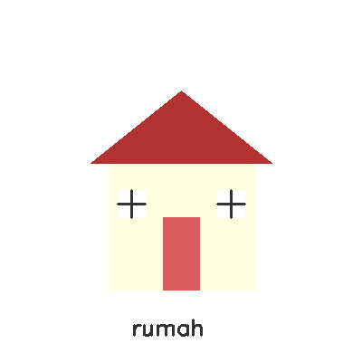

## Nama: Ardicha Triana Dewi
## NIM: 43050230007

##
##

## Karakter yang Dibuat
Karakter yang dibuat adalah **rumah sederhana** dengan:
- **Atap merah bata**  
- **Dinding biru muda**  
- **Pintu coklat**  
- **Dua jendela putih**  
- Dilengkapi tulisan “rumah” di bagian bawah.  

Gambar dibuat menggunakan fungsi-fungsi OpenCV seperti:
- `cv2.rectangle()` untuk dinding, pintu, dan jendela  
- `cv2.fillPoly()` untuk atap segitiga  
- `cv2.line()` untuk garis jendela  
- `cv2.putText()` untuk memberi label teks  

Hasil awal disimpan dengan nama `output/karakter.png`.

## Transformasi yang Diterapkan
1. **Translasi (cv2.warpAffine)**  
   Menggeser posisi rumah sejauh `(x=50, y=30)` piksel.  
   → Ditampilkan dengan `cv2.imshow("translasi", translated)`

2. **Rotasi (cv2.getRotationMatrix2D)**  
   Memutar rumah sebesar **30 derajat** dengan pusat di tengah kanvas.  
   → Disimpan ke `output/rotate.png`

3. **Resize (cv2.resize)**  
   Mengubah ukuran rumah menjadi **150% lebih besar** dari ukuran awal.  
   → Ditampilkan dengan `cv2.imshow("Resize", resized)`

4. **Crop**  
   Memotong bagian tengah rumah untuk menampilkan area penting.  
   → Disimpan ke `output/crop.png`

## Operasi Aritmatika dan Bitwise
1. **Bitwise OR (cv2.bitwise_or)**  
   Menggabungkan rumah dengan background biru muda.  
   → Hasil disimpan ke `output/bitwise.png`

2. **Add (cv2.add)**  
   Menambah kecerahan warna rumah agar terlihat lebih terang.  
   → Hasil disimpan ke `output/final.png`

## Screenshot hasil

